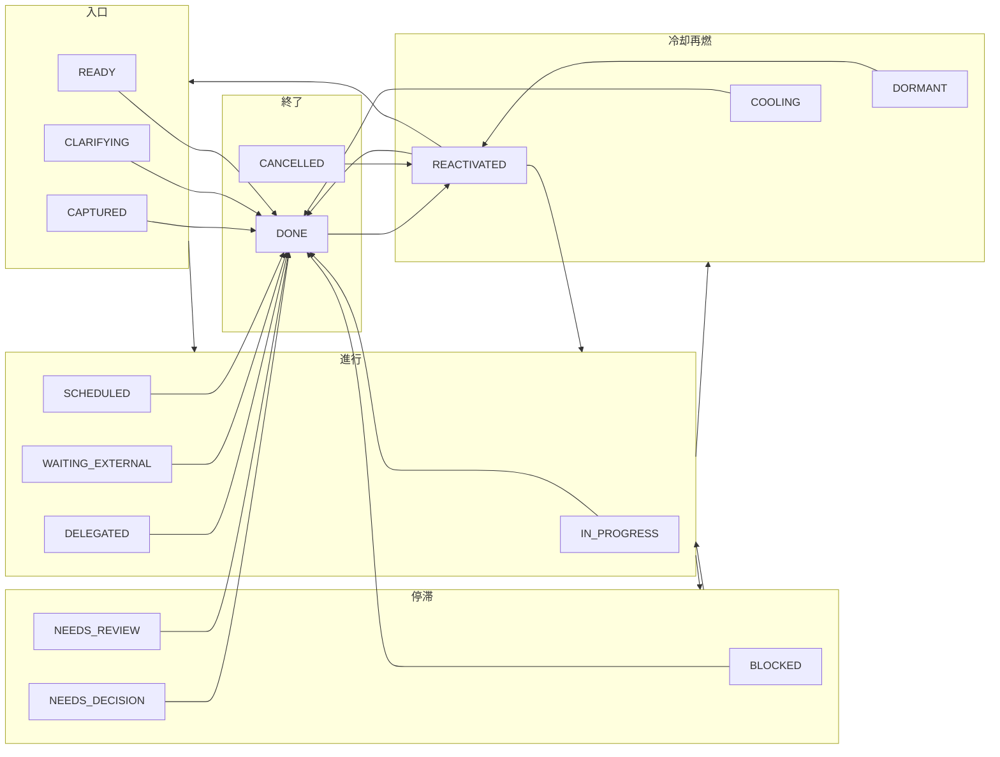

# 128 — Phase12-A：直接完了遷移の導入（設計・影響範囲・E2E計画）

どの状態からでも直接「完了」に遷移できるようにし、既存の状態遷移ルールは維持したまま完了のみ例外とする。

**参照**: docs/05_State_Machine.md、src/lib/stateMachine.ts、POST /api/nodes/{id}/estimate-status、Phase15-StatusQuickSwitch（124, 125, 126）。

---

## 1. 目的と制約

- **目的**: どの状態からでも直接「完了」に遷移できるようにする。
- **制約**:
  - 既存の状態遷移ルールは維持するが、**完了への遷移のみ**例外とする。
  - DB スキーマ変更なし。
  - 既存履歴・Apply フローを壊さない。
- **維持するもの**: 「中止」はそのまま（任意 → CANCELLED）。終了状態（DONE / CANCELLED）からの遷移は REACTIVATED のみのまま。

---

## 2. 仕様まとめ

| # | 仕様 |
|---|------|
| 1 | 状態ボタンに「完了」を常に表示し、**非活性にしない**（現在状態が「完了」のときと更新中を除く）。 |
| 2 | 任意の非終了状態から「完了」へ遷移可能とする（遷移マップの例外）。 |
| 3 | 履歴には通常どおり status_change を記録（node_status_history、既存フォーマット）。 |
| 4 | 更新中はボタンを非活性にする。エラーメッセージは**更新完了後に失敗した場合のみ**表示（既存の StatusQuickSwitch と同じ）。 |
| 5 | 既存の「中止」はそのまま維持（TRANSITIONS 変更なし）。 |

---

## 3. 状態遷移の扱い（設計の核）

### 3.1 現状

- `TRANSITIONS[from]` に含まれる `to` のみ遷移可能。
- DONE へ遷移できるのは、現状では IN_PROGRESS / DELEGATED / NEEDS_REVIEW など一部のみ。
- `isValidTransition(from, to)` は `TRANSITIONS[from]?.includes(to)` で判定。
- `getValidTransitions(from)` は `TRANSITIONS[from]` をそのまま返す。

### 3.2 例外ルール（Phase12-A）

- **追加ルール**: `to === "DONE"` かつ `from` が終了状態（DONE / CANCELLED）でないときは、**常に遷移可能**とする。
- 終了状態からは従来どおり DONE への遷移は不可（DONE → REACTIVATED のみ、CANCELLED → REACTIVATED のみ）。

### 3.3 状態遷移図（更新後のイメージ）

下記は「直接完了」を例外として含めた場合の**概念図**。実装は TRANSITIONS は変更せず、`isValidTransition` / `getValidTransitions` で例外処理する。

- 上記の「任意 → DONE」の矢印は、**既存の TRANSITIONS に列挙されていない from からも DONE へ遷移可能**であることを示す。
- CANCELLED は「任意 → CANCELLED」のまま維持（図では省略）。

---

## 4. 影響範囲

### 4.1 変更するファイル・モジュール

| 対象 | 変更内容 |
|------|----------|
| **src/lib/stateMachine.ts** | `isValidTransition(from, to)`: `to === "DONE"` かつ `from` が DONE/CANCELLED でなければ `true` を追加。`getValidTransitions(from)`: 返却配列に DONE が含まれていなければ末尾に追加（重複なし）。 |
| **docs/05_State_Machine.md** | §3 に「直接完了の例外」を 1 段落で追記。遷移概要に「任意 → DONE（Phase12-A）」を明記。 |

### 4.2 変更しないが挙動に影響を受けるもの

| 対象 | 影響 |
|------|------|
| **POST /api/nodes/[id]/estimate-status** | `isValidTransition` を使っているため、stateMachine の変更のみで「任意 → DONE」が許可される。コード変更不要。 |
| **POST /api/confirmations** | status_change は `from`/`to` の一致チェックのみ。from=現在 DB 状態・to=DONE で問題なし。変更不要。 |
| **StatusQuickSwitch** | `validTransitions={getValidTransitions(...)}` のため、getValidTransitions が DONE を返すようになれば「完了」が押せる。コンポーネント変更不要。 |
| **dashboard/page.tsx** | handleQuickSwitchClick は既存の confirmations → estimate-status の流れのまま。変更不要。 |
| **node_status_history** | 既存どおり from_status / to_status で記録。スキーマ・フォーマット変更なし。 |
| **ProposalPanel** | getValidTransitions を利用しているため、Apply 先に「完了」が含まれるようになる。既存 Apply フローはそのまま。 |

### 4.3 意図的に変更しないもの

- **TRANSITIONS 定数**: 既存の 1 対多の遷移マップはそのまま維持。例外は関数側でのみ扱う（仕様書・実装のトレーサビリティのため）。
- **DB スキーマ**: confirmation_events / node_status_history / nodes の構造は変更しない。
- **「中止」**: TRANSITIONS 上の CANCELLED への遷移は一切変更しない。

---

## 5. E2E 計画

### 5.1 観点

- 直接完了遷移が「全非終了状態から」許可されること。
- 履歴が通常どおり記録されること。
- 既存の「中止」と終了状態からの遷移が壊れていないこと。
- UI で「完了」が常に押せること（現在が完了でない限り）。

### 5.2 シナリオ一覧

| # | シナリオ | 手順 | 期待結果 |
|---|----------|------|----------|
| E1 | 捕捉 → 完了 | 状態「捕捉」のノードを開き、「完了」をクリック | 状態が「完了」に変わる。履歴に from=CAPTURED, to=DONE が 1 件記録される。 |
| E2 | 外部待ち → 完了 | 状態「外部待ち」のノードを開き、「完了」をクリック | 状態が「完了」に変わる。エラーが出ない。 |
| E3 | 障害あり → 完了 | 状態「障害あり」のノードを開き、「完了」をクリック | 状態が「完了」に変わる。 |
| E4 | 休眠 → 完了 | 状態「休眠」のノードを開き、「完了」をクリック | 状態が「完了」に変わる（直接完了の例外で許可）。 |
| E5 | 完了のボタンは非活性 | 状態が既に「完了」のノードを開く | 「完了」ボタンが active＋disabled で、再押下できない。 |
| E6 | 中止は従来どおり | 任意の非終了状態のノードで「中止」をクリック | 従来どおり「中止」に遷移する。遷移可能な状態は既存ルールのまま。 |
| E7 | 完了 → 再浮上のみ | 状態「完了」のノードを開く | 「完了」以外で押せるのは「再浮上」のみ（既存）。直接他状態へは遷移できない。 |
| E8 | 履歴の整合 | 上記いずれかで完了遷移後、履歴 API または履歴表示で確認 | node_status_history に from_status / to_status / reason 等が従来フォーマットで 1 件入っている。 |

### 5.3 実行方法・完了条件

- 手動 E2E で実施する想定（既存 Phase と同様）。
- 上記 E1〜E8 を実施し、すべて期待結果を満たしたら Phase12-A の E2E 合格とする。
- 必要に応じて、estimate-status のレスポンス（applied, from_status, to_status）や node_status_history の取得で自動化の余地あり。

---

## 6. 完了条件（Exit Criteria）

| # | 条件 |
|---|------|
| 1 | 状態ボタン「完了」が、現在状態が完了でない限り常に押せる（非終了状態で非活性にされない）。 |
| 2 | 任意の非終了状態から「完了」へ遷移できる（API が 422 を返さない）。 |
| 3 | 履歴に通常どおり status_change が記録される（node_status_history）。 |
| 4 | 更新中はボタンが非活性になる。失敗時のみエラーメッセージを表示する。 |
| 5 | 「中止」および終了状態（DONE/CANCELLED）からの遷移は既存どおり。 |
| 6 | DB スキーマ変更なし。既存の Apply・確認フローは壊れていない。 |

---

## 7. 参照ドキュメント

| 番号 | ファイル名 |
|------|------------|
| 05 | 05_State_Machine.md |
| 114 | 114_phase_status.md |
| 124 | 124_phase15_status_quick_switch_design.md |
| - | src/lib/stateMachine.ts |
| - | POST /api/nodes/{id}/estimate-status, POST /api/confirmations |

以上。Phase12-A 直接完了遷移の設計・影響範囲・E2E 計画とする。
